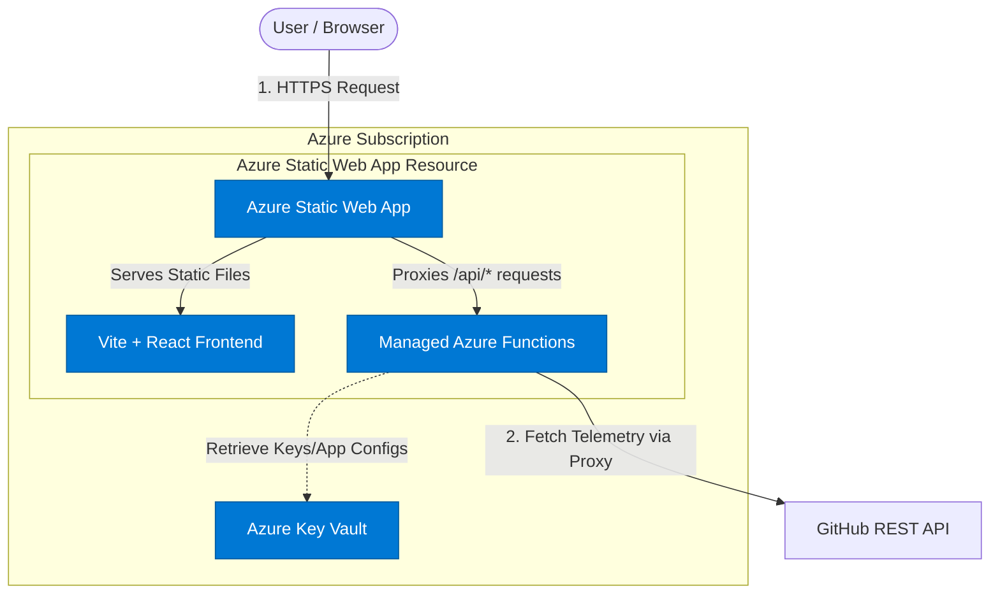
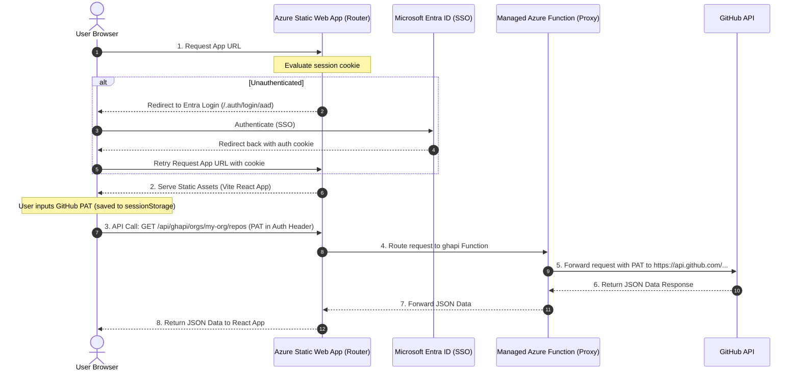

# 🚀 Azure Deployment Guide: GitHub Governance Hub

This document details the most cost-effective and secure architecture to deploy the **GitHub Governance Hub** to Microsoft Azure.

---

## 🏗️ Target Infrastructure Architecture

The proposed architecture relies entirely on **Serverless** components. This design achieves near-zero base costs (completely free under standard usage tiers) while enforcing strict enterprise security.



### 🔄 Request & Authentication Flow



---

## 🧮 Azure Components Breakdown

| Component | Choice / Tier | Rationale | Monthly Base Cost |
| :--- | :--- | :--- | :--- |
| **Frontend Hosting** | **Azure Static Web Apps (Free Tier)** | Hosts the pre-compiled Vite + React SPA. Offers automatic global CDN distribution, integrated SSL/TLS certificate renewal, and native GitHub Actions deployment integration. | **$0.00** |
| **Backend API Gateway** | **SWA Managed Functions (Consumption Tier)** | Acts as the production API proxy. Replaces the dev-time Vite `/ghapi` proxy. Automatically routes under the same domain (`/api`), resolving CORS without domain configuration. | **$0.00** (First 1M requests/mo free) |
| **Configuration & Secrets** | **Azure Key Vault (Standard Tier)** | Securely stores system environment variables, GitHub App Credentials (if upgrading from user-level PATs), or tenant configurations. | **~$0.03** (Charged per 10k transactions) |
| **Identity & Access** | **Microsoft Entra ID (Free Tier)** | Secures access to the dashboard. Azure SWA has native integration to restrict dashboard access to company directory users with zero custom login code. | **$0.00** |

---

## 🔐 Security Hardening Specifications

1. **No Backend Database Storage**: The application remains entirely stateless. GitHub Personal Access Tokens (PATs) enterable by users are kept strictly in browser `sessionStorage` and never persist on Azure.
2. **Managed Identities (passwordless)**: If deploying configuration parameters or accessing Azure Key Vault, the Managed Function uses a **System-Assigned Managed Identity**. No credentials/secrets are hardcoded in the codebase or environment variables.
3. **Enterprise SSO Enforcement**: Access to the static web app is locked down using `staticwebapp.config.json` rules so that only users authenticated via Microsoft Entra ID can access the site.
4. **HTTPS Enforced**: Azure SWA automatically redirects all HTTP traffic to HTTPS and manages TLS certificates transparently.

---

## 🛠️ Step-by-Step Deployment Walkthrough

### Step 1: Add Azure Static Web App Configuration
Create a `staticwebapp.config.json` file in the root directory to define routing and secure access to Entra ID:

```json
{
  "routeRules": [
    {
      "route": "/*",
      "allowedRoles": ["authenticated"]
    }
  ],
  "responseOverrides": {
    "401": {
      "redirect": "/.auth/login/aad",
      "statusCode": 302
    }
  }
}
```
*This config automatically redirects unauthenticated users to log in using Microsoft Entra ID (Azure AD) before they can view the dashboard.*

### Step 2: Implement the Azure Function Proxy
To route GitHub API requests, set up an Azure Managed Function under an `api` directory in the root. 

Create `/api/ghapi/index.js` (using Azure Functions Node.js Programming Model v4):

```javascript
const { app } = require('@azure/functions');
const fetch = require('node-fetch');

app.http('ghapi', {
    methods: ['GET', 'POST', 'PUT', 'DELETE'],
    authLevel: 'anonymous',
    route: 'ghapi/{*path}',
    handler: async (request, context) => {
        const path = request.params.path;
        const targetUrl = `https://api.github.com/${path}${new URL(request.url).search}`;
        
        // Forward request headers (including Authorization header containing user's PAT)
        const headers = {};
        for (const [key, value] of request.headers.entries()) {
            if (['authorization', 'accept', 'x-github-api-version', 'user-agent'].includes(key.toLowerCase())) {
                headers[key] = value;
            }
        }
        
        // Add safe fallback User-Agent if missing
        if (!headers['user-agent']) {
            headers['User-Agent'] = 'governance-hub-prod';
        }

        try {
            const response = await fetch(targetUrl, {
                method: request.method,
                headers: headers,
                body: request.method !== 'GET' && request.method !== 'HEAD' ? await request.text() : undefined
            });

            const responseData = await response.text();
            
            return {
                status: response.status,
                headers: {
                    'Content-Type': 'application/vnd.github+json',
                    'Access-Control-Allow-Origin': '*'
                },
                body: responseData
            };
        } catch (error) {
            context.log(`Error calling GitHub API: ${error.message}`);
            return {
                status: 500,
                body: JSON.stringify({ error: 'Failed to proxy request to GitHub API' })
            };
        }
    }
});
```

Update `src/App.jsx` in production to use the relative Azure Function endpoint:
```javascript
// From: const API_BASE = "/ghapi";
// To:   const API_BASE = "/api/ghapi";
```

### Step 3: Provision Resources in Azure

Run the following Azure CLI commands to create the resources in your subscription:

```bash
# 1. Create a Resource Group
az group create --name rg-github-governance --location westeurope

# 2. Provision Azure Static Web App
az staticwebapp create \
  --name swa-github-governance \
  --resource-group rg-github-governance \
  --source https://github.com/YOUR_ORG/github_governance \
  --branch main \
  --location westeurope \
  --login-with-github
```

### Step 4: Configure GitHub Actions Pipeline
The Static Web Apps creation process automatically injects a workflow file into `.github/workflows/`. Ensure the build configuration specifies Vite build settings:

```yaml
###### Inside .github/workflows/azure-static-web-apps-xxxx.yml ######
with:
  azure_static_web_apps_api_token: ${{ secrets.AZURE_STATIC_WEB_APPS_API_TOKEN_... }}
  action: "upload"
  app_location: "/" # App source code path
  api_location: "api" # Api source code path
  output_location: "dist" # Built app content folder
```

---

## 📈 TCO (Total Cost of Ownership) Analysis

| Usage Scenario | Monthly API Requests | Estimated Azure Cost |
| :--- | :--- | :--- |
| **Small Team (1-5 users)** | ~5,000 requests | **$0.00 / month** |
| **Medium Enterprise (50 users)** | ~100,000 requests | **$0.00 / month** |
| **Large Scale (200+ users)** | ~1,500,000 requests | **~$0.10 / month** (overage on Managed Functions) |
