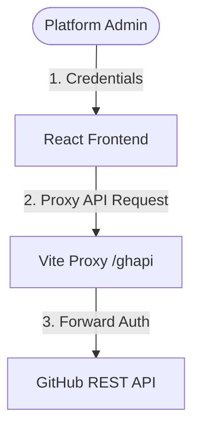

# ⎈ GitHub Governance Hub

An Enterprise Repository Intelligence dashboard built with React and Vite. It tracks compliance, build pipelines, pull requests, and security alerts across repositories in your GitHub Organization.

---

## 📖 Architecture & Workflow Documentation

We have documented the inner workings, data flows, and metrics scoring system in detail. 

👉 **Read the full [Workflow & Architecture Guide](file:///Users/kumam/Downloads/github_governance/workflow.md) (with Mermaid diagrams)**

### Quick Architecture Summary



The application functions by:
1. **Connecting via PAT (Personal Access Token)** securely stored in your browser's session storage.
2. **Discovering repositories** based on your choice of filter (All accessible, Topic, Team, Prefix, or Manual).
3. **Enriching repository metadata** by concurrently fetching branch protection, recent pipeline runs, open Dependabot/Secret/Code Scanning alerts, and pull requests.
4. **Calculating Compliance & Health Scores** to classify repositories into Healthy, At Risk, or Critical bands.

---

## 🚀 Getting Started

### Prerequisites
- [Node.js](https://nodejs.org/) (v18+ recommended)
- A GitHub Personal Access Token (PAT) with read permissions for metadata, contents, actions, security alerts, and pull requests.

### Installation & Run

1. Clone the repository and navigate to the directory:
   ```bash
   cd github_governance
   ```

2. Install dependencies:
   ```bash
   npm install
   ```

3. Run the development server:
   ```bash
   npm run dev
   ```

4. Open [http://localhost:5173](http://localhost:5173) in your browser.

---

## 🛠️ Tech Stack & Structure

- **Core**: React 19, Vite 8, JavaScript
- **Styling**: Vanilla CSS with curated theme tokens (Dark Mode)
- **API integration**: GitHub REST API v3 (v2022-11-28) via proxy configuration

```
github_governance/
├── src/
│   ├── App.jsx         # Main App Shell & Dashboard Views
│   ├── App.css         # Styling utilities
│   ├── index.css       # Core layout and styling resets
│   └── main.jsx        # App entrypoint
├── index.html          # HTML Entrypoint
├── vite.config.js      # Vite configuration & API proxy setup
└── workflow.md         # In-depth workflow diagrams & formulas
```
