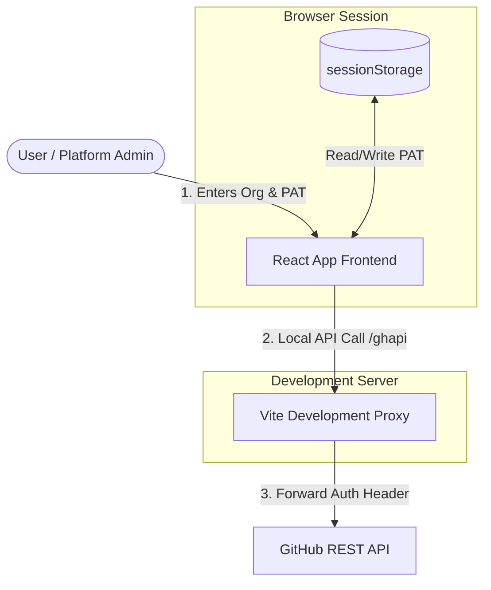
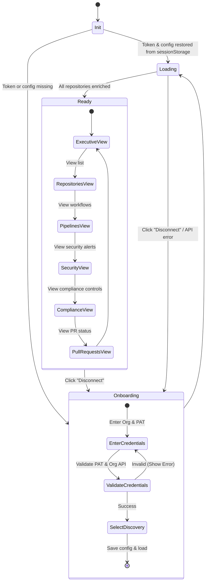

# GitHub Governance Hub — Architecture & Workflow

This document provides a detailed walkthrough of the GitHub Governance Hub application workflow, including pictorial representations of its data ingestion, enrichment pipelines, and health score calculations.

---

## 1. High-Level System Architecture

The application is a single-page React app that communicates with the GitHub API. In development, a Vite proxy is used to bypass CORS restrictions. In production, this can be swapped with a serverless function backend (e.g., Azure Functions).



---

## 2. Ingestion & Data Enrichment Pipeline

When a user logs in and chooses a repository discovery method, the app initiates a pipeline to fetch and enrich repository metrics concurrently.

```mermaid
sequenceDiagram
    autonumber
    actor User
    participant App as App Shell (App.jsx)
    participant Fetcher as Data Fetchers
    participant GitHub as GitHub API (via Proxy)
    
    User->>App: Input Org + PAT
    App->>GitHub: Validate PAT (getRateLimit & Org Info)
    GitHub-->>App: Rate limit + Org Metadata
    App->>App: Transition to "Loading" dashboard state
    
    App->>Fetcher: fetchRepos(org, mode, value)
    Fetcher->>GitHub: GET /orgs/{org}/repos (or selected scope)
    GitHub-->>Fetcher: Array of raw repo objects
    Fetcher-->>App: Raw Repos List
    
    loop For each Repo (Enrichment Loop)
        rect rgb(13, 20, 36)
            Note over App, GitHub: Concurrently fetches 7 governance facets
            App->>Fetcher: enrichRepo(org, repo)
            par Branch Protection
                Fetcher->>GitHub: GET .../branches/{default_branch}/protection
            and Workflow Runs
                Fetcher->>GitHub: GET .../actions/runs
            and Dependabot Alerts
                Fetcher->>GitHub: GET .../dependabot/alerts
            and Secret Alerts
                Fetcher->>GitHub: GET .../secret-scanning/alerts
            and Code Scanning Alerts
                Fetcher->>GitHub: GET .../code-scanning/alerts
            and Pull Requests
                Fetcher->>GitHub: GET .../pulls
            and CODEOWNERS check
                Fetcher->>GitHub: GET .../contents/CODEOWNERS
            end
            GitHub-->>Fetcher: Aggregated API Responses
            Fetcher->>Fetcher: Calculate Compliance (0-100%) & Health (0-100%)
            Fetcher-->>App: Enriched Repo Object
            App->>App: Update State (Renders incremental repo details)
        end
    end
    
    App->>App: Set state to "Ready"
```



---

## 3. Compliance and Health Score Calculation

The system evaluates each repository based on 6 core governance controls. Each control has an equal weight (16.6% each) towards the **Compliance Score**. The final **Health Score** is a composite metric combining compliance, pipeline success, and critical alert penalties.

```mermaid
graph TD
    subgraph Compliance Controls (Equal Weight)
        C1[Branch Protection Enabled] -->|16.7%| CompScore[Compliance Score 0-100%]
        C2[Required PR Reviews] -->|16.7%| CompScore
        C3[Signed Commits Enabled] -->|16.7%| CompScore
        C4[CODEOWNERS File Present] -->|16.7%| CompScore
        C5[Strict Status Checks] -->|16.7%| CompScore
        C6[Auto-merge Disabled] -->|16.7%| CompScore
    end

    subgraph Metrics Ingestion
        Pipelines[Pipeline Success Rate %] -->|30% Weight| Health
        CompScore -->|40% Weight| Health[Composite Health Score 0-100%]
        
        Alerts[Critical Alerts Count] -->|Penalty: 15% per alert, max 30%| AlertPenalty[Alert Penalty 0-30%]
        AlertPenalty -->|Subtracted from remaining 30%| Health
    end

    style Health fill:#14532d,stroke:#22c55e,stroke-width:2px,color:#fff
```

### Formula Details

| Metric | Weight / Impact | Details |
| :--- | :--- | :--- |
| **Compliance Score** | **40% of Health** | Percentage of the 6 security controls successfully configured. |
| **Pipeline Success Rate** | **30% of Health** | Based on the last 10 GitHub Action workflow runs. Defaults to 70% if no workflows are present. |
| **Zero Critical Alerts** | **30% of Health** | Starts at 30 points. Deducts **15 points per critical alert** (from Dependabot or Secret Scanning), capped at a maximum 30-point deduction. |

> [!NOTE]
> **Health Bands Classification:**
> *   💚 **Healthy (≥85%)**: Excellent governance posture and stable builds.
> *   💛 **At Risk (65–84%)**: Missing multiple controls or has minor build failures.
> *   ❤️ **Critical (<65%)**: Missing critical compliance rules or has active critical alerts/failing pipelines.

---

## 4. UI Dashboard Interaction & Navigation

Once loaded, the React application shell manages views using simple reactive state hooks:


